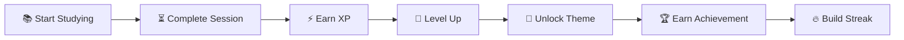

<div align="center">

# ⚡ Gamified Study Timer ⚡


<br>


<br><br>

### 🌟 Turn Every Study Session Into An Adventure 🌟

*"Focus. Earn XP. Level Up. Repeat."*

</div>

---

## 🌈 About The Project

⚡ **Gamified Study Timer** is a productivity application designed to make studying fun, interactive, and rewarding.

Instead of simply counting minutes, users can:

✨ Earn XP by completing focus sessions  
🎮 Progress through levels  
🏆 Unlock achievements  
🔥 Maintain study streaks  
🎨 Switch between exciting themes  
📈 Track study progress visually

The goal is simple:

> **Transform productivity into a game.**

---

## ⚠️ Development Status

```diff
+ This project is actively being developed.
+ New features are being added regularly.
+ UI improvements and theme updates are in progress.

! Current version is NOT the final release.
! More themes, achievements and features are coming soon.
```

---

# ⚡ Current Features

<table>
<tr>

<td width="50%">

### ⏳ Study Timer

- Focus Sessions
- Productivity Tracking
- Session Completion Rewards
- Timer Progress Display

</td>

<td width="50%">

### 🎮 Gamification

- XP System
- Level Progression
- Achievement Rewards
- Streak Tracking

</td>

</tr>
</table>

---

# 🎨 Theme Collection

### 🐧 Piplup Theme
A cool blue theme for the beginning of your journey.

### ⭐ Shinchan Theme
Bright, playful and energetic.

### 🤖 Doraemon Theme
Futuristic focus vibes.

### 🐱 Oggy Theme
For dedicated students who keep leveling up.

---

# 📊 Progress System

```text
Level      ▰▰▰▰▰▰▰▱▱▱ 70%

XP         2450 / 3500 ⚡

Streak     🔥 12 Days

Focus      📚 154 Hours
```

---

# 🎮 Study Journey



---

# 📸 Preview

<div align="center">

## 🚧 Screenshots & GIFs Coming Soon 🚧

### Future Showcase

📱 Live Study Sessions  
⚡ XP Progression  
🎮 Theme Switching  
🏆 Achievement Unlocks

</div>

---

# 🛠️ Tech Stack

```yaml
Frontend:
  - React
  - Vite

Language:
  - JavaScript

Styling:
  - CSS3

Version Control:
  - Git
  - GitHub
```

---

# 🚀 Installation

```bash
git clone https://github.com/your-username/gamified-study-timer.git

cd gamified-study-timer

npm install

npm run dev
```

---

# 🌱 Planned Features

### 🎯 Productivity

- Daily Goals
- Weekly Analytics
- Session History
- Focus Insights

### 🎮 Gamification

- More Levels
- More XP Rewards
- Daily Quests
- Rare Achievements

### 🎨 Themes

- Pikachu Theme ⚡
- Eevee Theme 🌟
- Gengar Theme 👻
- Snorlax Theme 😴

### ☁️ Future

- Cloud Sync
- Mobile Version
- User Profiles
- Leaderboards

---

# ⚡ Why This Project?

Most study timers only tell you how much time has passed.

This project aims to make studying:

✨ Fun  
🎮 Interactive  
🏆 Rewarding  
📈 Motivating

Every study session contributes toward a bigger goal.

---

<div align="center">

## 💛 Pikachu Inspired Color Palette 💛

🟨 Pikachu Yellow — #FFD93D

🟫 Warm Brown — #8B5E34

⚫ Midnight Black — #1E1E1E

⚪ Soft White — #FFF8E7

⚡ Electric Gold — #FFC300

</div>

---

<div align="center">


### ⭐ If you like this project, consider giving it a star ⭐

### 💛 Built with passion, caffeine, and countless study sessions 💛

</div>
